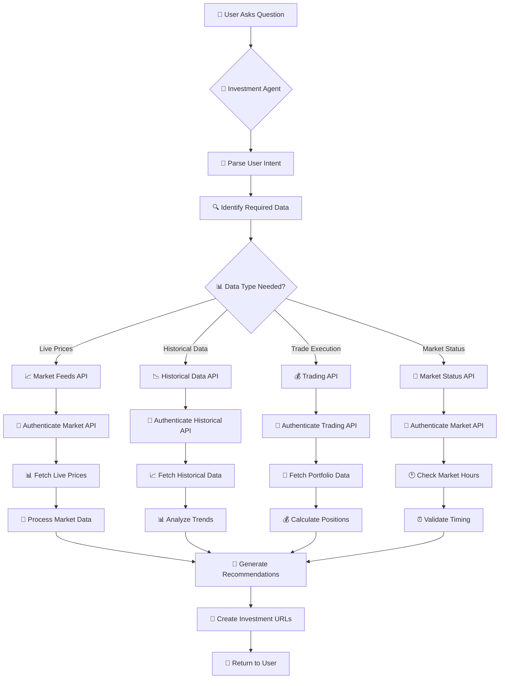

# Angel One Data Flow - Investment Agent

## 🔄 Complete Data Flow: User Question → Angel One APIs → Investment Recommendation



## 📋 Detailed Step-by-Step Flow

### 1. 🎯 **User Question Processing**
```
User: "Should I invest ₹50,000 in Nifty ETFs today?"
```

### 2. 🤖 **Agent Analysis**
- **Intent Recognition**: Investment advice request
- **Amount**: ₹50,000
- **Asset Class**: Nifty ETFs
- **Timing**: Today (immediate)

### 3. 📊 **Data Requirements Identification**
The agent determines it needs:
- ✅ Live prices for Nifty ETFs
- ✅ Market status (is market open?)
- ✅ Historical performance data
- ✅ Current market trends

### 4. 🔌 **API Selection & Authentication**

#### **Market Feeds API** (for live prices)
```python
# services/enhanced_angel_one_service.py
market_api = SmartConnect(api_key=ANGEL_ONE_MARKET_API_KEY)
# Usually works without login for basic data
```

#### **Historical Data API** (for trend analysis)
```python
historical_api = SmartConnect(api_key=ANGEL_ONE_HISTORICAL_API_KEY)
# Authenticate if needed
```

#### **Trading API** (if user wants to execute)
```python
trading_api = SmartConnect(api_key=ANGEL_ONE_TRADING_API_KEY)
# Requires full authentication with TOTP
```

### 5. 📈 **Data Fetching Process**

#### **Step 5a: Get Live Prices**
```python
# Get current price of NIFTYBEES
price_data = market_api.ltpData(
    exchange="NSE",
    tradingsymbol="NIFTYBEES",
    symboltoken="26000"
)
current_price = price_data['data']['ltp']  # ₹185.50
```

#### **Step 5b: Check Market Status**
```python
# Check if market is open
market_status = market_api.getMarketData(
    mode="LTP", 
    exchangeTokens={"NSE": ["26000"]}
)
is_market_open = market_status['data']['fetched'][0]['marketStatus']
```

#### **Step 5c: Get Historical Data**
```python
# Get 30-day historical data for trend analysis
historical_data = historical_api.getCandleData(
    exchange="NSE",
    symboltoken="26000",
    interval="ONE_DAY",
    fromdate="2024-06-24 09:00",
    todate="2024-07-24 15:30"
)
```

#### **Step 5d: Calculate Investment Details**
```python
# Calculate how many units user can buy
investment_amount = 50000
units_to_buy = investment_amount // current_price  # 269 units
actual_investment = units_to_buy * current_price   # ₹49,915
```

### 6. 🧠 **Data Processing & Analysis**

#### **Price Analysis**
```python
# Analyze if current price is good
recent_high = max(last_30_days_prices)  # ₹190.20
recent_low = min(last_30_days_prices)   # ₹178.30
current_position = (current_price - recent_low) / (recent_high - recent_low)
# 0.6 = 60% between low and high (moderate level)
```

#### **Trend Analysis**
```python
# Calculate moving averages
sma_5 = sum(last_5_days) / 5      # ₹184.20
sma_20 = sum(last_20_days) / 20   # ₹182.50
trend = "BULLISH" if sma_5 > sma_20 else "BEARISH"
```

### 7. 🎯 **Recommendation Generation**

```python
recommendation = {
    "action": "BUY",
    "confidence": "HIGH",
    "reasoning": [
        f"Market is currently OPEN",
        f"NIFTYBEES trading at ₹{current_price} (good entry level)",
        f"Short-term trend is {trend}",
        f"Can buy {units_to_buy} units for ₹{actual_investment}"
    ],
    "risk_level": "LOW",
    "time_horizon": "LONG_TERM"
}
```

### 8. 🔗 **Investment URL Creation**

```python
# Create Angel One basket URL for easy execution
basket_data = {
    "basket_name": "Artha_Investment_Plan",
    "instruments": [
        {
            "symbol": "NIFTYBEES",
            "quantity": units_to_buy,
            "price": current_price,
            "exchange": "NSE"
        }
    ]
}

investment_url = f"https://trade.angelone.in/basket?data={encoded_basket_data}"
```

### 9. 📱 **Response to User**

```
🎯 Investment Recommendation for ₹50,000 in Nifty ETFs

📊 Current Analysis:
• NIFTYBEES: ₹185.50 (Market is OPEN)
• Trend: BULLISH (5-day SMA > 20-day SMA)
• Position: 60% between recent high/low (good entry)

💰 Investment Plan:
• Units to buy: 269
• Actual investment: ₹49,915
• Remaining cash: ₹85

✅ Recommendation: BUY NOW
• Confidence: HIGH
• Risk Level: LOW
• Time Horizon: LONG_TERM

🔗 [Invest Now via Angel One](https://trade.angelone.in/basket?data=...)
```

## 🔄 **API Fallback Strategy**

```python
def get_live_price(symbol):
    try:
        # Try Market API first (fastest)
        return market_api.ltpData(symbol)
    except:
        try:
            # Fallback to Trading API
            return trading_api.ltpData(symbol)
        except:
            # Fallback to estimated price
            return get_estimated_price(symbol)
```

## ⚡ **Performance Optimization**

1. **Parallel API Calls**: Fetch multiple data points simultaneously
2. **Caching**: Cache frequently requested data for 1-2 minutes
3. **Smart Routing**: Use fastest API for each data type
4. **Error Handling**: Graceful fallbacks ensure system always works

## 🔐 **Security & Authentication**

- **Market API**: Minimal auth for public data
- **Trading API**: Full TOTP authentication for trades
- **Historical API**: Token-based authentication
- **Credentials**: Securely stored in environment variables

This flow ensures your investment agent provides **real-time, accurate, and actionable** investment advice using live Angel One data! 🚀