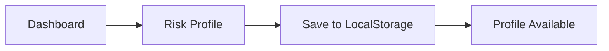
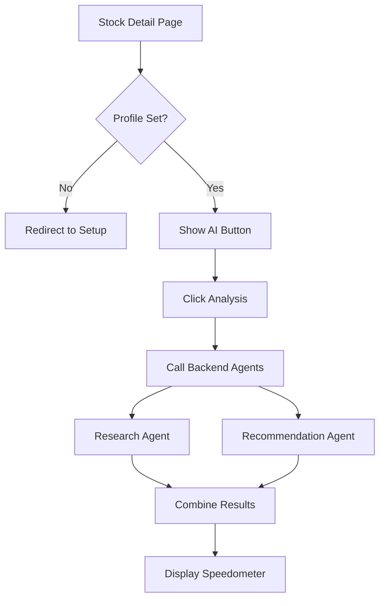
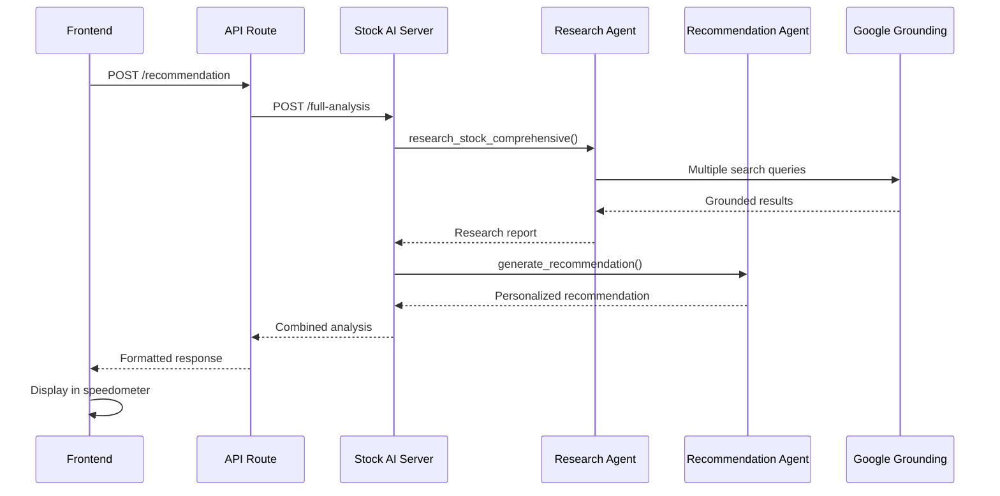

# 🤖 Stock AI Agents System

**Comprehensive Stock Research & Personalized Investment Recommendations**

Powered by Google AI Grounding Technology & Real-time Market Intelligence

---

## 🎯 **Overview**

The Stock AI Agents system provides institutional-grade stock analysis and personalized investment recommendations through two specialized AI agents:

### **🔍 Stock Research Agent**
- **Comprehensive market intelligence** using Google Search Grounding
- **7-area analysis framework**: Technical, Fundamental, Market Sentiment, Sector Analysis, Management Quality, Growth Prospects, and Risk Factors
- **Real-time data synthesis** from multiple web sources with citation tracking
- **Professional research reports** with confidence scoring

### **🎯 Stock Recommendation Agent** 
- **Personalized recommendations** based on user investment profile
- **Risk-aligned scoring** (0-100) with detailed sentiment analysis
- **Multi-factor evaluation** considering user preferences and stock characteristics
- **Actionable investment plans** with specific amounts and timing strategies

---

## 🚀 **Quick Start**

### **1. Installation**

```bash
# Navigate to the stock agents directory
cd backend/agents/stock_agents

# Install required packages
pip install -r requirements.txt
```

### **2. Environment Setup**

```bash
# Set your Google AI API key for full AI capabilities
export GOOGLE_AI_API_KEY="your_google_ai_api_key_here"

# Optional: Set custom port (default: 8001)
export PORT=8001
```

### **3. Start the System**

```bash
# Easy start with setup script
python start_stock_agents.py

# Or direct server start
python stock_api_server.py
```

### **4. Frontend Integration**

```bash
# In your frontend environment
export STOCK_AI_URL="http://localhost:8001"
```

---

## 📚 **API Endpoints**

### **Health & Status**

```http
GET /health
# Returns system health status

GET /api/agents/status  
# Returns detailed agent initialization status
```

### **Stock Research**

```http
POST /api/stock/research
Content-Type: application/json

{
  "symbol": "TCS.NS",
  "company_name": "Tata Consultancy Services"  // optional
}
```

**Response**: Comprehensive research report with 7 analysis areas

### **Personalized Recommendation**

```http
POST /api/stock/recommend
Content-Type: application/json

{
  "symbol": "TCS.NS",
  "user_profile": {
    "riskTolerance": "moderate",     // conservative|moderate|aggressive
    "investmentHorizon": "long",     // short|medium|long  
    "investmentGoal": "growth",      // growth|income|balanced
    "monthlyInvestment": 25000
  },
  "stock_data": {
    "currentPrice": 3500,
    "marketCap": "13.5L Cr"
  },
  "research_data": { ... }  // optional - will auto-research if not provided
}
```

**Response**: Personalized recommendation with score, sentiment, and action plan

### **Complete Analysis (Recommended)**

```http
POST /api/stock/full-analysis
Content-Type: application/json

{
  "symbol": "TCS.NS",
  "company_name": "Tata Consultancy Services",
  "user_profile": {
    "riskTolerance": "moderate",
    "investmentHorizon": "long",
    "investmentGoal": "growth",
    "monthlyInvestment": 25000
  },
  "stock_data": {
    "currentPrice": 3500,
    "marketCap": "13.5L Cr"
  }
}
```

**Response**: Complete research + personalized recommendation in one call

---

## 🏗️ **System Architecture**

```
Frontend (Next.js)
      ↓
API Route (/api/stocks/recommendation)
      ↓
Stock AI Server (Flask - Port 8001)
      ↓
┌─────────────────┬─────────────────┐
│  Research Agent │ Recommendation  │
│                 │     Agent       │
│ • Google Search │ • User Profile  │
│   Grounding     │   Analysis      │
│ • 7-Area        │ • Risk Scoring  │
│   Analysis      │ • Action Plans  │
│ • Real-time     │ • Investment    │
│   Data          │   Suitability   │
└─────────────────┴─────────────────┘
```

---

## 🎨 **Frontend Features**

### **🎛️ User Risk Profile Component**
- **Interactive profile setup** on dashboard
- **Risk tolerance selection** (Conservative/Moderate/Aggressive)
- **Investment horizon** (Short/Medium/Long-term)
- **Investment goals** (Growth/Income/Balanced)
- **Monthly budget slider** with visual feedback

### **🎯 Animated Speedometer Component**
- **Smooth 0-100 score animation** with Framer Motion
- **Color-coded sentiment indicators** (Strong Buy to Strong Sell)
- **Tabbed interface** (Overview/Analysis/Details)
- **Interactive elements** with hover effects and confidence levels

### **📊 Stock Detail Page Integration**
- **"Get AI Recommendation" button** with loading states
- **Profile validation** and setup prompts
- **Real-time analysis progress** indicators
- **Comprehensive results display** with actionable insights

---

## 🔬 **Research Methodology**

### **Multi-Source Intelligence Gathering**

1. **Technical Analysis**
   - Chart patterns and trends
   - Technical indicators (RSI, MACD, Moving Averages)
   - Support/resistance levels
   - Volume analysis

2. **Fundamental Analysis**
   - Financial metrics and ratios
   - Earnings quality assessment
   - Balance sheet strength
   - Cash flow analysis

3. **Market Sentiment**
   - News sentiment analysis
   - Analyst ratings compilation
   - Social media trends
   - Institutional activity

4. **Sector Analysis**
   - Industry trends and outlook
   - Competitive positioning
   - Market share dynamics
   - Regulatory environment

5. **Management Quality**
   - Leadership track record
   - Corporate governance
   - Strategic vision assessment
   - Execution capabilities

6. **Growth Prospects**
   - Business expansion plans
   - New product pipelines
   - Market opportunities
   - Future catalysts

7. **Risk Assessment**
   - Company-specific risks
   - Sector headwinds
   - Regulatory challenges
   - Financial vulnerabilities

---

## ⚙️ **Configuration**

### **Environment Variables**

```bash
# Required for full AI capabilities
GOOGLE_AI_API_KEY=your_google_ai_api_key

# Optional configuration
PORT=8001                    # Server port (default: 8001)
DEBUG=false                  # Debug mode (default: false)
STOCK_AI_URL=http://localhost:8001  # Frontend integration URL
```

### **User Profile Schema**

```typescript
interface UserProfile {
  riskTolerance: 'conservative' | 'moderate' | 'aggressive';
  investmentHorizon: 'short' | 'medium' | 'long';
  investmentGoal: 'growth' | 'income' | 'balanced';
  monthlyInvestment: number;  // Amount in INR
}
```

---

## 🔄 **Integration Workflow**

### **1. User Setup**


### **2. Stock Analysis**


### **3. Data Flow**


---

## 🛡️ **Error Handling**

### **Graceful Degradation**
- **AI agents unavailable** → Fallback to rule-based analysis
- **API timeout** → Cached results with refresh options
- **No user profile** → Prompt for profile setup
- **Invalid symbols** → Error messages with suggestions

### **Monitoring & Logging**
- **Request/response logging** for debugging
- **Performance metrics** tracking
- **Error rate monitoring** with detailed stack traces
- **AI confidence tracking** for quality assessment

---

## 🎯 **Example Usage**

### **Complete Analysis Example**

```python
import asyncio
from research_agent import StockResearchAgent
from recommendation_agent import StockRecommendationAgent

async def analyze_stock():
    # Initialize agents
    research_agent = StockResearchAgent()
    recommendation_agent = StockRecommendationAgent()
    
    # Perform research
    research = await research_agent.research_stock_comprehensive(
        "TCS.NS", "Tata Consultancy Services"
    )
    
    # User profile
    user_profile = {
        "riskTolerance": "moderate",
        "investmentHorizon": "long", 
        "investmentGoal": "growth",
        "monthlyInvestment": 25000
    }
    
    # Generate recommendation
    recommendation = await recommendation_agent.generate_recommendation(
        research, user_profile, {"currentPrice": 3500}
    )
    
    print(f"Score: {recommendation['score']}/100")
    print(f"Sentiment: {recommendation['sentiment']}")
    print(f"Action: {recommendation['action_plan']['primary_action']}")

# Run analysis
asyncio.run(analyze_stock())
```

---

## 🚀 **Production Deployment**

### **Docker Deployment**

```dockerfile
FROM python:3.11-slim

WORKDIR /app
COPY requirements.txt .
RUN pip install -r requirements.txt

COPY . .
EXPOSE 8001

CMD ["python", "stock_api_server.py"]
```

### **Environment Setup**

```yaml
# docker-compose.yml
version: '3.8'
services:
  stock-ai-agents:
    build: .
    ports:
      - "8001:8001"
    environment:
      - GOOGLE_AI_API_KEY=${GOOGLE_AI_API_KEY}
      - PORT=8001
    restart: unless-stopped
```

---

## 📈 **Performance & Scalability**

### **Response Times**
- **Research Analysis**: 30-60 seconds (7 concurrent searches)
- **Recommendation Generation**: 5-10 seconds
- **Combined Analysis**: 45-75 seconds

### **Optimization Features**
- **Concurrent API calls** for faster research
- **Response caching** for repeated requests
- **Timeout handling** with graceful fallbacks
- **Rate limiting** to prevent API abuse

---

## 🔧 **Troubleshooting**

### **Common Issues**

**1. "Agents not initialized"**
```bash
# Check API key configuration
echo $GOOGLE_AI_API_KEY

# Verify requirements installation
pip install -r requirements.txt
```

**2. "Timeout errors"**
```bash
# Increase timeout in frontend API call
# Check network connectivity
# Monitor Google AI API status
```

**3. "Fallback mode activated"**
```bash
# Verify Stock AI server is running on port 8001
curl http://localhost:8001/health

# Check frontend STOCK_AI_URL configuration
```

### **Debug Mode**

```bash
# Start server in debug mode
DEBUG=true python stock_api_server.py

# Check logs for detailed error information
tail -f /var/log/stock-ai-agents.log
```

---

## 🤝 **Contributing**

### **Development Setup**

```bash
# Clone and setup
git clone <repository>
cd backend/agents/stock_agents

# Install development dependencies
pip install -r requirements.txt
pip install pytest black flake8

# Run tests
pytest tests/

# Format code
black *.py
```

### **Adding New Research Areas**

1. **Update `research_agent.py`** with new query definitions
2. **Modify analysis synthesis** to include new areas
3. **Update recommendation scoring** to use new data
4. **Add frontend display components** for new insights

---

## 📄 **License**

This Stock AI Agents system is part of the Artha-Agent project and follows the same licensing terms.

---

## 🆘 **Support**

For technical support, feature requests, or bug reports:

1. **Check the troubleshooting section** above
2. **Review system logs** for error details  
3. **Verify environment configuration** and API keys
4. **Test with simple requests** to isolate issues

---

**🎉 Ready to provide institutional-grade stock analysis with personalized recommendations!**